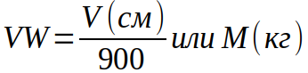

Задание:

1. Необходимо получить список ячеек постамата подходящих для размещения посылки.
На вход принимаем габариты посылки, в ответ отправляем список ячеек.

2. Необходимо получать общий объем всех ячеек постамата

3. Необходимо получать общий объемный вес всех ячеек постамата. Объемный вес считается как max(максимальная грузоподъемность ячейки, объем ячейки в см3/900)

